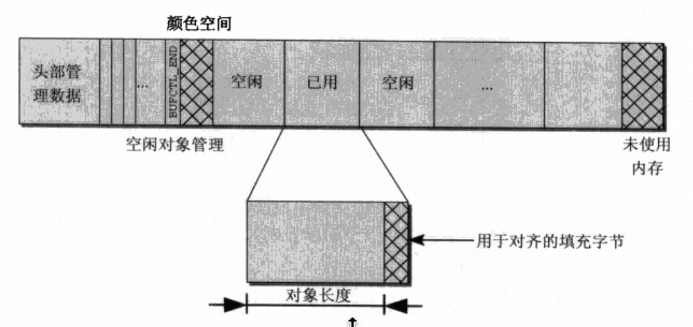
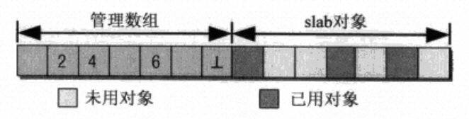

# 物理内存管理

## 物理内存探测

### LoongArch 启动过程简介

### 基于 UEFI 的物理内存探测

在 Linux 中，在 LoongArch 上面就采用了基于 UEFI 进行物理内存探测的工作。

## memblock

在 LoOS 开发的早期，我们使用了基于链表的简单内存管理模式。我们在此给予简单介绍。

假如我们只需要固定大小的内存，如何构造一个分配复杂度 O(1) ，且回收复杂度也是
O(1) 的系统？

答案非常简单，只需要一个单向链表将所有空闲块连接起来即可。这样就可以把分配转换
为获取链表头，回收转换为插入链表头的 O(1) 操作。

该方法的优点是实现简单，插入和回收都是 O(1) 复杂度。缺点是其只能分配定长的物理
内存，不能分配小于（比如 sizeof(struct) ）或者大于（连续物理页分配）的内存。

早期 LoOS 的实现中借鉴了 xv6 操作系统。

### 基本结构

```c
struct run {
    struct run *next;
};

struct {
    struct run *freelist;
} kmem;
```

目前已经被废弃。

## 伙伴系统

伙伴系统（Buddy System）是一种内存管理技术，用于动态分配和回收内存。它通过将内
存划分为固定大小的块，并通过合并这些块来管理内存。其基本思想是将内存块以二进制
形式组织起来，形成一棵树形结构。

### page 结构体

更加高阶的内存分配要求更加复杂的结构来辅助。下面我们将引入 struct page 结构体
来表示页的各种信息：

```c
struct page {
    struct list_head freelists;
    uint64_t flags;
    uint64_t order;
    uint64_t alloc;
};
```

其中，

- flags 标记了该页的属性
- order 标记了该页的大小为 2^order
- alloc 标记了该页是否已经被分配
- freelists 用来确定当前的 page 在空闲链表中的位置

#### 页转换

如在物理内存地址布局中说的，物理内存分配的来源在 0x80000000 到 0x90000000 这个
区域。这个区域的大小为 0x10000000 字节，也就是 256 MB 。

```c

#define MEM2       0x80000000
#define PKERNBASE  0x90000000
#define PMEMALLOC_START      MEM2
#define PMEMALLOC_END        PKERNBASE
#define MEMALLOC_START       PHYS_TO_MAIN(MEM2)
#define MEMALLOC_END         PHYS_TO_MAIN(PKERNBASE)
#define PMEM_AVAIL           (PMEMALLOC_END - PMEMALLOC_START)
#define PMEM_AVAIL_PAGE      16384
```

我们让 pages[0] 对应 0x80000000 的第一个页，以此类推。

```c
#define MAX_ORDER_BUDDY 15
#define NDX(P)          (((uint64_t)P - (uint64_t)&pages) / sizeof(struct page))

extern struct page pages[PMEM_AVAIL_PAGE];
extern struct list_head buddy_free_lists[MAX_ORDER_BUDDY];

#define PFN_TO_PADDR(X) (PGSIZE * X + MAP_PHYSICAL_MEMORY)
#define PADDR_TO_PFN(X) ((X - MAP_PHYSICAL_MEMORY) / PGSIZE)
```

因此，将一个 struct page * page 转换为对应的地址就是 PFN_TO_PADDR(NDX(page))
。目前我们不考虑多段内存的存在，类似于 Linux 物理内存管理中的 FLATMEM 平坦内存
模型。

#### LoOS 中伙伴系统的规约

伙伴系统的实现有多种方式，特别是在 page.alloc 的处理上面。在 LoOS 中，
我们认为，如果存在一个 p 使得 p 的大小覆盖了某些页，且 p 的空闲状态是空闲，那么我们认为被覆盖的所有页空闲状态都应该是忙。

```c
void __check_pages(struct page * start_page, uint64_t num){
    for (int ndx = 0 ; ndx < num ; ndx ++){
        assert(ndx % (1 << (start_page + ndx)->order) == 0);
        assert(ndx == 0 || ndx % (1 << ((start_page + ndx)->order + 1)) != 0);
        struct page *buddy_page = __get_buddy_page(start_page + ndx);
        if ( (start_page + ndx)->alloc == 0 &&
                (start_page + ndx)->order == buddy_page->order &&
                buddy_page->alloc == 0 )
        {
            Log("check pages vaild: page %d and buddy page %d both avail, no merge\n", ndx, NDX(buddy_page));
        }
        if ( (start_page + ndx)->alloc == 1 ) continue;
        for ( int i = ndx + 1; i < ndx + (1 << (start_page + ndx)->order) ; i ++ ){
            if ( (start_page + i)->alloc != 1 ){
                Log("check pages vaild: page %d is not alloc --  \
                        page %d is with order %d and allocable\n",
                        i, ndx, 1 << ((start_page + ndx)->order));
            }
        }
    }
}
```

另外，伙伴系统最基本的一个规约就是假如一个页和它的伙伴页都空闲，那么应该将它们
合并为一个。

在 LoOS 中，我们采用了统一往小合并的方法。具体来说，下面列出了一张 index 与应
该被合并到的 index 的表（待补充）：

### 伙伴系统辅助函数

#### 页切分

```c
struct page * __split_pages(uint64_t order, struct page * page){
    assert(page->alloc == 0);
    if ( page->order == order ) return page;
    struct page * new_page = page + (1 << (page->order - 1));
    (page + (1 << (page->order - 1)))->alloc = 0;
    new_page->alloc = 0;
    assert((page + (1 << (page->order - 1)))->order == (page->order - 1));
    assert(new_page->order == (page->order - 1));
    list_add(&(buddy_free_lists[new_page->order]), &(new_page->freelists));

    page->order = page->order - 1;
    return __split_pages(order, page);
}
```

split_pages 的逻辑很简单，对于一个页，首先检查其是不是已经符合需要的大小，然后

1. 使它的伙伴页空闲。（ alloc 置为 0 ，加入其大小对应的空闲链表）
2. 使它的 order 降一等。
3. 继续 split_page 它自己。

#### 页合并

```c
// return the final new page.
struct page * __merge_pages(struct page * page){
    // Log("Merge page: pages[%d]\n", NDX(page));
    assert(page->alloc == 0);
    if(page->order == MAX_ORDER_BUDDY){
        return page;
    }
    struct page * buddy_page = __get_buddy_page(page);
    if( buddy_page->alloc == 0 && buddy_page->order == page->order){
        if(NDX(buddy_page) % (1 << (page->order + 1) ) == 0){
            page->alloc = 1;
            list_del(&(page->freelists));
            buddy_page->order = buddy_page->order + 1;
            return __merge_pages(buddy_page);
        } else {
            buddy_page->alloc = 1;
            list_del(&(buddy_page->freelists));
            page->order = page->order + 1;
            return __merge_pages(page);
        }
    }
    return page;
}
```

注意到一个有趣的事实：每次我们释放一个页，经过若干次合并后，最终真正从已分配变
成空闲的的也有且仅有一个页。所以我们的 merge_pages 函数有返回值，就是这个最终
变得空闲的页。 

了解了这个事实后去看 merge_pages ，逻辑就变得清晰了。获取了当前页的伙伴页后，
检查哪个页才是最终应该被合并到的页。（这里采用了向小合并的方法，如“规约”一章中
所述）随后将被合并的页置为已分配，从空闲列表中删除，然后继续合并合并到的页。

### 分配和释放

#### 分配

```c
struct page * __kalloc_pages_buddy_order(uint64_t order){
    struct page * page = NULL;
    for (int i = order ; i < MAX_ORDER_BUDDY ; i ++) {
        struct list_head * cur_list_head = &(buddy_free_lists[i]);
        if ( list_is_empty(cur_list_head) ) continue;
        page = list_entry(cur_list_head->next, struct page, freelists);
        if (page) break;
    }
    assert(page);
    page = __split_pages(order, page);
    list_del(&(page->freelists));
    page->alloc = 1;
    return page;
}
```

分配某个 order 的页逻辑非常简单，只需要从小（order）到大依次遍历空闲链表，发现
空闲页后将其切分到需要的 order 即可。

LoOS 为它提供了一些封装：

```c
struct page * __kalloc_pages_buddy(uint64_t page_num){
    assert(page_num <= ( 1 << MAX_ORDER_BUDDY ));
    for ( int i = 0 ; i <= MAX_ORDER_BUDDY ; i ++){
        if ( (1 << i) >= page_num ) return __kalloc_pages_buddy_order(i);
    }
}
```

kalloc_pages_buddy 可以根据需要分配的页数目决定 order 。

#### 释放

```c
void __kfree_pages_buddy(struct page * page){
    assert(page->alloc == 1);
    if(page->alloc != 1) panic("kfree");
    page->alloc = 0;
    struct page * new_page = __merge_pages(page);
    list_del(&(new_page->freelists));
    list_add(&(buddy_free_lists[new_page->order]), &(new_page->freelists));
}
```

在页释放中可以发现在页合并一节中有趣事实的作用，在合并完后只需要将一个页加入空
闲列表即可。（导入在那之前需要先从原来的列表中删除！）

### 辅助函数

除了上面所说的 check_pages 函数，LoOS Buddy System 还有其它一些辅助函数：

```c
void __dump_pages(struct page * start_page, uint64_t num) {
    Log("&(buddy_free_lists[0].next) = %p\n", &(buddy_free_lists[0].next));
    for (int ndx = 0 ; ndx < num ; ndx ++){
        Log("page %d: alloc = %d, order = %d\n",
                ndx,
                (start_page + ndx)->alloc,
                (start_page + ndx)->order);
    }

    for(int ord = 0 ; ord < MAX_ORDER_BUDDY ; ord ++){
        Log("for buddy_free_lists[%d], these pages are in it:\n", ord);
        struct page * pos;
        struct list_head * test;
        int counter = 0;
        list_for_each_entry(pos, &(buddy_free_lists[ord]), freelists){
            int ndx = ((uint64_t)pos - (uint64_t)&pages) / sizeof(struct page);
            printf("pages = %p, pos = %p, size = %d\n", &pages, pos, sizeof(struct page));
            printf(" ndx: %d\n", ndx);
            Log("    page %p (ndx %d) in order %d\n", (pos), NDX(pos), ord);
            counter ++;
            if ( counter >= 20) panic("1");
        }
    }
}
```

dump_pages 可以辅助调试。

### 总结

伙伴系统是一个历史久远，运用广泛的系统。哪怕在现在的 Linux 内核中，大于一个页
的内存分配也是使用伙伴系统来完成的，它同时还是 slab 分配器的后端。它拥有诸多的
好处：

1. 可以将外部碎片的内部碎片都控制在很小的范围内
2. 理论上可以分配大于一个页的连续内存
3. 分配复杂度和回收复杂度都是 O(logN) ，非常适合时间要求高的内核场景

## slab 分配器

slab 分配器来源于 Sun 公司 Jeff Bonwick 的论文 "The Slab Allocator: An Object-Caching Kernel Memory Allocator" 。

它首先被运用在 FreeBSD 的内核内存分配算法中，随后被移植到了 Linux 上。在 Linux
上，一个简化版的设计在改进后诞生了，这就是 slub 分配器。考虑到这两者有着几乎一
样的接口，并且存在前驱/后继的关系，Linux 并没有改变包括源代码架构在内的外部接
口，因此不少人会将这两者弄混。

slob 分配器是为嵌入式系统特化的内存分配器，以短小和分配开销小为特点。

关于 Linux 内核中这三者的区别，可以参阅 [slaballocators.pdf](https://events.static.linuxfound.org/sites/events/files/slides/slaballocators.pdf) 
获得进一步的信息。

在 LoOS 中，我们实现了在没有 NUMA 相关特性下的 slub 分配器。下面简述 LoOS 中
slub 分配器的设计。

### kmem_cache 结构体

对于每一种 slab ，我们都需要指定一个结构来管理它们。我们采用和 Linux 内核一样
的名称：kmem_cache 。

```c
struct kmem_cache {
    const char name[SLAB_NAME_LEN];
    uint64_t size;
    uint64_t object_size;
    uint64_t num;
    uint64_t object_offset;
    uint64_t free_offset;
    struct list_head full_slab;
    struct list_head partial_slab;
    struct list_head free_slab;
};
```

1. name 为该 kmem_cache 的名字。
2. size 为单位大小。
3. object_size 为实际的对象大小。
4. num 为目前 kmem_cache 中存储的对象数量。
5. object_offset 为存储 object 的地方与页开头的偏移。
6. free_offset 为存储 freelist 的地方与页开头的偏移。
7. full_slab, partial_slab 和 free_slab 分别表示属于 kmem_cache 的 slab 链表

#### size 和 object_size

为什么同时有 size 和 object_size ？虽然目前这两者是相同的，但是后面可能分开。
其中的一部分原因在于对齐通常可以加快访问速度，另一部分原因在于我们需要一些手段
来监测是否越界写了，将对齐到 size 的字节赋值为特殊的值，随后就可以通过检查这些
特殊的值有没有被修改过，进而发现是否存在越界写：



#### freelists



更加详细的解释见 “页内内存分配” 一节。

就如同页结构体的 pages 数组是直接放在内核二进制文件中一样，kmem_cache 的 kcs
数组也是直接放在内核二进制文件中。

### kmem_cache 函数

#### 新 kmem_cache 分配

因为 kmem_cache 通常不会变动，在 LoOS 中我们直接采用了在数组 kcs 中寻找空闲的
kmem_cache 。

```c
void __alloc_kmem_cache(char * name, uint64_t size, uint64_t object_size, uint64_t num, uint64_t object_offset, uint64_t free_offset){
    int i = 0;
    for ( i = 0 ; i < MAX_KC ; i ++){
        if ( kcs[i].size == 0) break;
    }
    strcpy(kcs[i].name, name);
    kcs[i].size = size;
    kcs[i].object_size = object_size;
    kcs[i].num = num;
    kcs[i].object_offset = object_offset;
    kcs[i].free_offset = free_offset;
    init_list_head(&kcs[i].full_slab);
    init_list_head(&kcs[i].partial_slab);
    init_list_head(&kcs[i].free_slab);
}

void new_kmem_cache(char * name, uint64_t size){
    uint64_t object_size = size;
    uint64_t free_offset = 0;
    uint64_t object_offset = OBJECT_OFFSET;
    uint64_t num = (PGSIZE - object_size) / size;
    __alloc_kmem_cache(name, size, object_size, num, object_offset, free_offset);
}
```

#### kmem_cache 初始化

因为 slab 分配器主要处理小于一个 PGSIZE 的内存分配请求，所以我们创建的
kmem_cache 大致遵循了这个原则：

```c
void init_kmem_cache(){
    new_kmem_cache("kc-16b", 16);
    new_kmem_cache("kc-32b", 32);
    new_kmem_cache("kc-64b", 64);
    new_kmem_cache("kc-128b", 128);
    new_kmem_cache("kc-256b", 256);
    new_kmem_cache("kc-512b", 512);
    new_kmem_cache("kc-1kb", 1024);
    new_kmem_cache("kc-2kb", 2048);
    new_kmem_cache("kc-4kb", 4096);
    // dump_kmem_cache();
    // test_slab_alloc();
}
```

#### kmem_cache 辅助函数

```c
void dump_kmem_cache(){
    for ( int i = 0 ; i < MAX_KC ; i ++ ){
        struct page * iter;
        if ( kcs[i].size == 0) break;
        printf("%s size = %d, num = %d\n", kcs[i].name, kcs[i].size, kcs[i].num);
        printf("list all full_slab: \n");
        list_for_each_entry(iter, &kcs[i].full_slab, slab_list){
            if ( iter->kc != &kcs[i] ) {
                printf("iter = %p\n", iter);
                printf("NDX = %d\n", NDX(iter));
                panic("slab dump");
            }
            dump_slab(iter);
        }
        printf("list all partial_slab: \n");
        list_for_each_entry(iter, &kcs[i].partial_slab, slab_list){
            if ( iter->kc != &kcs[i] ) {
                printf("iter = %p\n", iter);
                printf("NDX = %d\n", NDX(iter));
                panic("slab dump");
            }
            dump_slab(iter);
        }
        printf("list all free_slab: \n");
        list_for_each_entry(iter, &kcs[i].free_slab, slab_list){
            if ( iter->kc != &kcs[i] ) {
                printf("iter = %p\n", iter);
                printf("NDX = %d\n", NDX(iter));
                panic("slab dump");
            }
            dump_slab(iter);
            // printf("page %d: c_num = %d first_free = %d\n", NDX(iter), iter->c_num, iter->first_free);
        }
    }
}
```

```
```

### page 结构体

```c
struct page {
    struct list_head freelists;
    uint64_t flags;
    uint64_t order;
    uint64_t alloc;
    uint64_t c_num;
    uint16_t first_free;
    struct kmem_cache * kc;
    struct list_head slab_list;
};
```

我们重用了 struct page 来存储 slab 相关信息。

1. first_free 标记了第一个空闲的 object 所在的索引。
2. c_num 表示当前 slab 中已经分配的 object 数。
3. kc 表示当前页属于哪个 kmem_cache 。
4. slab_list 用来将 slab/page 连接在一起。

#### 初始化 page

伙伴系统是 slab 分配器的后端，当 kmem_cache 需要一个新的 slab 来处理请求时，就会调用 alloc_free_slab 。

```c
struct page * __alloc_free_slab(struct kmem_cache * kc){
    struct page * page = kalloc_pages_buddy(1);
    void * base = PFN_TO_PADDR(NDX(page));
    page->kc = kc;
    page->c_num = 0;
    page->first_free = 0;
    uint16_t * frees = base + kc->free_offset;
    for ( int off = 0 ; off < kc->num ; off ++ ){
        frees[off] = off + 1;
    }
    frees[kc->object_offset / sizeof(uint16_t) - 1] = 65535;
    return page;
}
```

### 页内内存管理

如何在一段内存中分配定长的内存？在 “页内内存分配” 这个主题中，我们遇到了和
memblock 一样的问题。因此我们可以借鉴它的思路：用链表将空闲的内存块串在一起。

这样做有几个好处：

1. 分配和释放的复杂度都很低（ O(1) ）
2. 最近被释放的块会被最早分配，这意味着其有很大可能还停留在缓存中

唯一的不一样是我们用数组来表示链表，而不是真正的用地址串在一起的链表。这样可以
节省空间。


#### 页内内存分配

```c
void * __kalloc_bytes_from_page(struct page * slab){
    assert(slab->kc->num > slab->c_num);
    slab->c_num += 1;
    uint16_t * frees = PFN_TO_PADDR(NDX(slab)) + slab->kc->free_offset;
    uint64_t objects = PFN_TO_PADDR(NDX(slab)) + slab->kc->object_offset;
    uint64_t stores = objects + slab->kc->size * slab->first_free;
    slab->first_free = frees[slab->first_free];
    if ( slab->c_num == slab->kc->num ) __move_partial_to_full(slab);
    return (void*)stores;
}
```

#### 页内内存释放

```c
void __kfree_bytes_from_page(struct page * slab, void * paddr){
    assert(PFN_TO_PADDR(NDX(slab)) == PGROUNDDOWN((uint64_t)paddr));
    void * base = PFN_TO_PADDR(NDX(slab));
    uint16_t pindex = (paddr - base - slab->kc->object_offset) / (slab->kc->size);
    assert((paddr - base - slab->kc->object_offset) % (slab->kc->size) == 0);
    uint16_t * frees = base + slab->kc->free_offset;
    frees[pindex] = slab->first_free;
    slab->first_free = pindex;
    slab->c_num -= 1;
}
```

### 总结

#### 内存分配流程

```c
void * kalloc_bytes_slab(uint64_t size){
    assert(size < PGSIZE);
    struct kmem_cache * kc;
    int cur_size = 0xFFFFF;
    for ( int i = 0 ; i < MAX_KC ; i ++ ){
        if ( kcs[i].size >= size ) {
            if ( kcs[i].size < cur_size ){
                kc = &kcs[i];
                cur_size = kcs[i].size;
            }
        }
    }
    if(list_is_empty(&kc->free_slab)){
        struct page * np = __alloc_free_slab(kc);
        list_add(&kc->free_slab, &np->slab_list);
    }
    if(list_is_empty(&kc->partial_slab)){
        struct page * fp = list_entry(kc->free_slab.next, struct page, slab_list);
        list_del(&fp->slab_list);
        list_add(&kc->partial_slab, &fp->slab_list);
    }
    return __kalloc_bytes_from_page(list_entry(kc->partial_slab.next, struct page, slab_list));
}
```

我们首先需要找到一个合适的 kmem_cache 来分配。这里的合适指的是，大于等于需要的
内存大小，但是比其它的 kmem_cache 大小都要小。

#### 内存释放流程

```c
void kfree_bytes_slab(void * paddr){
    struct page * page = &pages[PADDR_TO_PFN(PGROUNDDOWN((uint64_t)paddr))];
    assert(page->kc != NULL);
    __kfree_bytes_from_page(page, paddr);
    if ( page->c_num == page->kc->num - 1 ){
        __move_full_to_partial(page);
    }
}
```

## 总结

在有了伙伴系统和 slab 分配器之后，终于可以得到目前 LoOS 中用的物理内存管理系统
了。

```c
void * kmalloc(int size){
    if ( size >= PGSIZE ){
        struct page * result = kalloc_pages_buddy((size-1) / PGSIZE + 1);
        return PFN_TO_PADDR(((uint64_t)result - (uint64_t)&pages) / sizeof(struct page));
    } else {
        return kalloc_bytes_slab(size);
    }
}
```

```
void kfree(void * paddr){
    if ( (uint64_t)paddr % PGSIZE == 0 ) {
        free_counts += 1;
        kfree_pages_buddy(&pages[PADDR_TO_PFN((uint64_t)paddr)]);
    } else {
        kfree_bytes_slab(paddr);
    }
}
```

### 未来计划

1. 锁机制
2. 非均匀访存模型（NUMA）
3. gfp_flags （物理内存分类 and 分配内存标志）
4. 物理内存发现（UEFI, ACPI 支持）
5. 增加多种内存模型（平坦内存模型，分段内存模型，稀疏内存模型）
