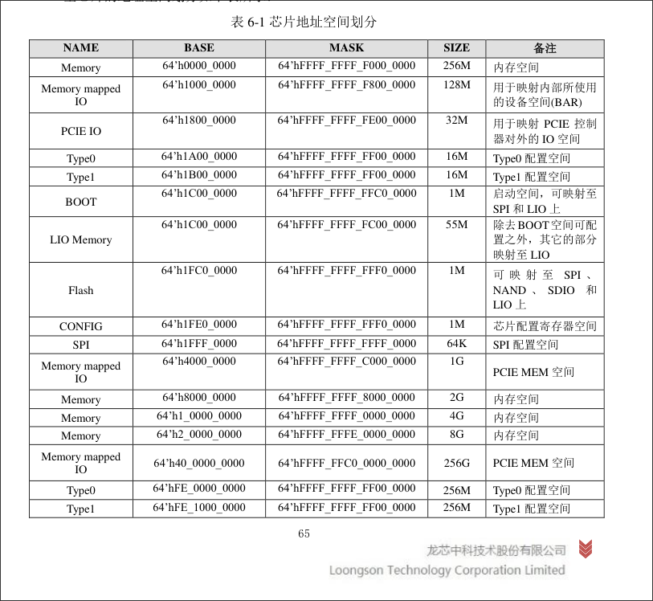
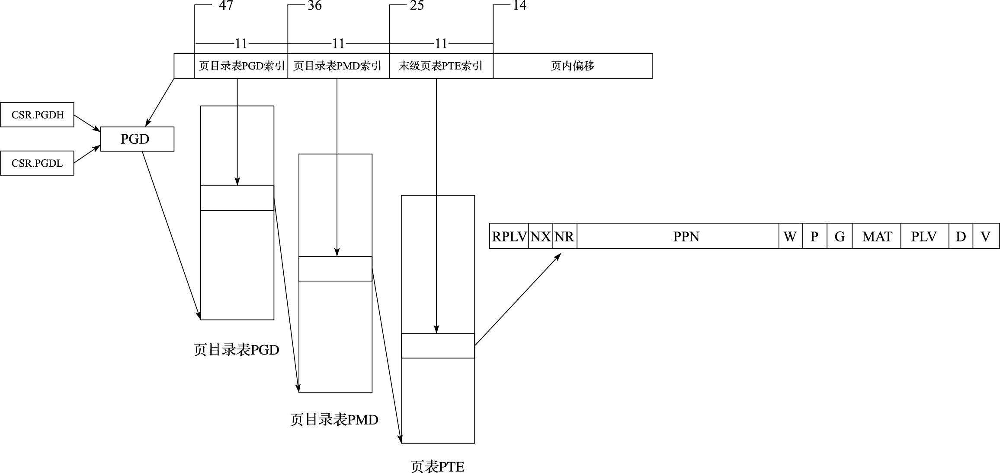

# LoOS 中的虚拟内存管理

虚拟内存是操作系统中最重要的部分之一。它为用户级的进程提供了几个有用的性质：

1. 无须重定位。操作系统可以同时加载数个 entry_point 在同一地址的进程。
2. 隔离性。进程不会平凡地访问（读/写）其它进程的地址空间。
3. 允许加载大于物理内存大小的进程映像。

下面我们将讨论在 LoOS 中使用的，硬件（CPU MMU）辅助的基于页表的虚拟内存管理方
法。

## 物理内存地址布局

Physical Memomry Layout

目前 LoOS 与 LS2K1000 开发版是耦合的，故讨论物理内存布局就是在讨论 LS2K1000 开发版的内存路由。



```c
// physical memory

#define MEM1       0x0
#define MMIO1      0x10000000
#define PCIEIO     0x18000000
#define TYPE0      0x1A000000
#define TYPE1      0x1B000000
#define LIOMEM     0x1C000000
#define BOOT       0x1FC00000
#define CONFIG     0x1FE00000
#define SPI        0x1FFF0000
#define MMIO2      0x40000000
#define MEM2       0x80000000
#define PKERNBASE  0x90000000
#define MEM3      0x100000000
#define MEM4      0x200000000
#define MMIO_PCIE 0x400000000
```

考虑到开发板的内存不大，因此我们只考虑到 MMIO_PCIE 的位置。

## 直接映射机制

LoongArch 体系结构与 x86 / ARM / RISC-V 在物理内存管理上很大的一点不同是
LoongArch 提供了 DMW 寄存器组。

在 LoOS 中，我们这么运用 DMW 寄存器组：

```c
void dmw_init() {
    w_csr_dmw0(get_dmw_data(0x9000, MAT_CC, DMW_PLV0));
    w_csr_dmw1(get_dmw_data(0xA000, MAT_CC, DMW_PLV0));
    w_csr_dmw2(get_dmw_data(0x8000, MAT_SUC, DMW_PLV0));
}
```

```c
#define UNCACHED_MEMORY_ADDR 0x8000000000000000
#define MAIN_KERNEL_DMW      0x9000000000000000
#define MAP_PHYSICAL_MEMORY  0xA000000000000000
```

也就是说，在进行了如上设置后，0x8000000000000000 - 0x9000000000000000,
0x9000000000000000 - 0xA000000000000000, 以及 0xA000000000000000 - 0xB000000000000000
都会被映射到 0x0 - 0x1000000000000000 上面。我们分别讨论它们的作用：

### UNCACHED_MEMORY_ADDR

> 强序也就是顺序一致性，Sequential Consistency 。但是即使采用了这种 MAT ，
> LoongArch 硬件也只能保证访存操作符合顺序一致性，不保证取值操作没有副作用。
> 
> 这种 MAT 通常用于访问映射到 IO/Config 的内存段（也就是 MMIO ）。

这就是引入 UNCACHED_MEMORY_ADDR 的意义。

```c
#define PHYS_TO_UNCACHED(addr) (UNCACHED_MEMORY_ADDR | (addr))

#define UART0                PHYS_TO_UNCACHED(0x1fe20000)
#define SATA_ADDR            PHYS_TO_UNCACHED(0x400e0000)
#define UART0_RHR            (UART0 + 0)
#define UART0_THR            (UART0 + 0)
#define UART0_LSR            (UART0 + 5)
#define LSR_TX_IDLE          (1 << 5)

#define PMC_BASE        PHYS_TO_UNCACHED(0x1fe27000)
#define REBOOT_ADDR     (PMC_BASE + 0x30)
#define REBOOT_MASK     0x1
#define POWEROFF_ADDR   (PMC_BASE + 0x14)
#define POWEROFF_MASK   0x3c00
```

上面列出来的，包括但不限于 UART0, AHCI, QEMU PMC 的接口，都是典型的 MMIO 。

另外，因为不考虑在 UNCACHED_MEMORY_ADDR 上执行代码，所以 UNCACHED_MEMORY_ADDR
使用 DMW2 作为映射窗口。（只有 DMW0 和 DMW1 支持在上面取指）

### MAIN_KERNEL_DMW

MAIN_KERNEL_DMW 是在 U-Boot 启动阶段就被设置好的映射窗口。在 loongarch.lds 中
也能发现，整个内核的入口就在 0x9000000090000000 处。因此，内核中的代码和符号都
是在 MAIN_KERNEL_DMW 对应的映射窗口上的。

### MAP_PHYSICAL_MEMORY

MAP_PHYSICAL_MEMORY 用于内存分配。伙伴系统的初始化和分配和释放都使用这个地址前
缀。因为分配的内存

## 页表机制

### LoongArch 硬件机制

### LoOS 中的页表结构设计

LoOS 采用了三级页表的形式。具体的组织形式如下：



注：图片来源 [第 3 章 特权指令系统 | 计算机体系结构基础](https://foxsen.github.io/archbase/sec-privileged-ISA.html#%E5%AD%98%E5%82%A8%E7%AE%A1%E7%90%86%E7%9A%84%E5%8E%9F%E7%90%86)

1. 页大小为 16 KB ，也就是 2^14 
2. 总共有三级页表，每级页表需要用 11 位来寻址
3. VALEN = 48, 14 + 3 * 11 = 47 ，故实际上 VA 的最高位不会用到
4. 一个 PTE 的大小是 64 位，故一个页（16 KB）中可以含有 16 KB / 8 Bytes = 2048
   个 PTE
5. 刚好，一级页表需要保存的 PTE 数目也是 2^11 = 2048

### 页表项简介

## 虚拟内存 API

### 内存管理进程结构

```c
void __proc_add_mapping(struct proc *proc, uint64_t pa, uint64_t va, uint64_t size, uint64_t perm) {
    struct mapping *mapping = (void*)malloc(sizeof(struct mapping));
    if ( va == 0 )printf("map %d : pgtbl %p: va %p, pa %p perm %x\n", proc->pid, proc->pgtbl, va, pa, perm);
    mapping->pa = pa;
    mapping->va = va;
    mapping->size = size;
    mapping->perm = perm;
    mlist_push(proc->mapping_list, mapping);
}
```


### 基于页表的内存映射

#### 单页映射

```c
int __map_single_page(pagetable_t pagetable, uint64_t va, uint64_t pa, uint64_t perm){
    Log("map_single_page: %p to %p\n", pa, va);
    if ( va == 0) printf("map_single_page: %p to %p\n", pa, va);
    uint64_t a, last;

    pagetable_t iter_pagetable = pagetable;
    Log("pagetable: %p, iter_pagetable: %p\n", iter_pagetable, pagetable);
    for(int level = 2; level >= 1 ; level -- ){
        uint64_t index = PX(level, va);
        Log("index of level %d is %x\n", level, index);
        uint64_t pte = iter_pagetable[index];
        if ( pte == 0 ){
            Log("no pte for current layer, allocing\n");
            void * new_pagetable = kmalloc(PGSIZE);
            memset(new_pagetable, 0, PG_SIZE);
            iter_pagetable[index] = (uint64_t) new_pagetable;
        }
        pte = iter_pagetable[index];
        Log("level %d pagetable(%p) [%d] is assign to %p\n", level, iter_pagetable, index, pte);
        iter_pagetable = (uint64_t *)pte;
    }
    uint64_t t_pte = iter_pagetable[PX(0, va)];
    iter_pagetable[PX(0, va)] = PA2PTE(pa) | PTE_FLAGS(iter_pagetable[PX(0, va)]) | perm;
    Log("final level, index %d is assign to %x\n", PX(0, va), iter_pagetable[PX(0,va)]);
    Log("perm is %d\n", perm);
    return 0;
}
```

#### 多页映射

```
int __map_pages(pagetable_t pagetable, uint64_t va, uint64_t size, uint64_t pa, uint64_t perm)
{
    Log("mappages: %p to %p, length = %d\n", pa, va, size);
    uint64_t va_start = PGROUNDDOWN(va);
    uint64_t va_end = PGROUNDDOWN(va + size - 1);
    uint64_t pa_map = PGROUNDDOWN(pa);
    Log("va_start = %p, va_end = %p, pa_map = %p\n", va_start, va_end, pa_map);
    for (uint64_t vac = va_start ; vac <= va_end ; vac += PGSIZE) {
        // Log("into the circle\n");
        __map_single_page(pagetable, vac, pa_map, perm);
        pa_map += PGSIZE;
    }
}
```

#### 新建页映射

```c
// Allocate PTEs and physical memory to grow process from oldsz to
// newsz, which need not be page aligned.  Returns new size or 0 on error.
uint64_t alloc_vm(struct proc * proc, uint64_t start, uint64_t end, uint64_t perm){
    pagetable_t pagetable = proc->pgtbl;
    Log("alloc vm from proc %s , start %p end %p\n", proc->name, start, end);
    end = PGROUNDUP(end);
    for ( uint64_t caddr = start ; caddr < end ; caddr += PGSIZE ){
        void * new_mem = kmalloc(PGSIZE);
        if ( !new_mem ) panic("kalloc");
        memset(new_mem, 0, PGSIZE);
        if ( __map_single_page(pagetable, caddr, (uint64_t)new_mem, perm) != 0 ) panic("__map_single_page");
        __proc_add_mapping(proc, (uint64_t)new_mem, caddr, PGSIZE, perm);
    }
}

```

### 虚拟/物理地址

#### 虚拟/物理地址转换

```c
uint64_t va_to_pa(pagetable_t pagetable, uint64_t va)
{
    pte_t *pte;
    uint64_t pa;

    if(va >= MAXVA)
        return 0;

    pte = va_to_pte_pointer(pagetable, va, 0);
    if(pte == 0) return 0;
    Log("va is %p\n", va);
    Log("*pte is %p\n", *pte);
    Log("*pte flags are %x\n", PTE_FLAGS((uint64_t)(*pte)));
    if((*pte & PTE_V) == 0){
        Log("PTE_V of %p is 0\n", pte);
        return 0;
    }
    pa = PTE2PA(*pte);
    return (uint64_t)pa;
}
```

```c
pte_t * va_to_pte_pointer(pagetable_t pagetable, uint64_t va, int alloc)
{
    // Log("walk pagetable %p from va %p, alloc = %d\n", pagetable, va,alloc);
    if(va >= MAXVA)
      panic("walk");
    
    pagetable = (void*)PA2VA(pagetable);
    for(int level = 2; level > 0; level--) {
        pte_t *pte = &pagetable[PX(level, va)];
        // Log("&pte = %p pagetable = %p *pte = %p\n", pte, pagetable, *pte);
        if(*pte) {
            pagetable = (pagetable_t)(PTE2PA(*pte) );
            pagetable = (void*)PA2VA(pagetable);
        } else {
            if(!alloc || (pagetable = (pte_t*)kmalloc(PGSIZE)) == 0)
                return 0;
            memset(pagetable, 0, PGSIZE);
            *pte = PA2PTE(pagetable) | PTE_V;
        }
    }
    // Log("final pte = %p, *pte = %p\n", pagetable[PX(0,va)], &pagetable[PX(0,va)]);
    return &pagetable[PX(0, va)];
}
```

#### 虚拟/物理地址数据转移

```c
int copy_from_va(pagetable_t pagetable, char *dst, uint64_t srcva, uint64_t len)
{
    uint64_t n, va0, pa0;

    while(len > 0){
        va0 = PGROUNDDOWN(srcva);
        pa0 = va_to_pa(pagetable, va0);
        if(pa0 == 0) return -1;
        n = PGSIZE - (srcva - va0);
        if(n > len)  n = len;
        Log("copyin %p\n", (void *)PA2VA((pa0 + (srcva - va0))));
        memmove(dst, (void *)PA2VA((pa0 + (srcva - va0))), n);
        len -= n;
        dst += n;
        srcva = va0 + PGSIZE;
    }
    return 0;
}

// Copy a null-terminated string from user to kernel.
// Copy bytes to dst from virtual address srcva in a given page table,
// until a '\0', or max.
// Return 0 on success, -1 on error.
int copy_from_va_str(pagetable_t pagetable, char *dst, uint64_t srcva, uint64_t max)
{
    uint64_t n, va0, pa0;
    int got_null = 0;

    while(got_null == 0 && max > 0){
        va0 = PGROUNDDOWN(srcva);
        pa0 = va_to_pa(pagetable, va0);
        if(pa0 == 0) return -1;
        n = PGSIZE - (srcva - va0);
        if(n > max) n = max;

        char *p = (char *) PA2VA((pa0 + (srcva - va0)));
        while(n > 0){
            if(*p == '\0'){
                *dst = '\0';
                got_null = 1;
                break;
            } else {
                *dst = *p;
            }
            --n;
            --max;
            p++;
            dst++;
        }

        srcva = va0 + PGSIZE;
    }
    if(got_null){
        return 0;
    } else {
        return -1;
    }
}//todo
``` 

### 页表管理

#### 页表分配

```c
pagetable_t pgtbl_create(){
    pagetable_t pgtbl = (pagetable_t) kmalloc(PGSIZE);
    if ( pgtbl ){
        memset(pgtbl, 0, PGSIZE);
        return pgtbl;
    }
    return 0;
}
```

#### 页表释放

```c
// FIXME: leak memory
void pgtbl_free(struct proc *p) {
    struct mapping *info = NULL;
    void *list = p->mapping_list;
    while ( !mlist_is_empty(list)) {
        info = mlist_pop(list);
        void *pa = PA2VA(info->pa);
        kfree(pa);
        free(info);
    }
    free_pagetable(p->pgtbl, 2);
}
```

```c
void free_pagetable(pagetable_t pgtbl, int level){
    if ( level == 0 ) {
        kfree(pgtbl);
        return ;
    }
    for ( int i = 0 ; i < (1 << PTWIDTH) ; i ++ ){
        pagetable_t it_pgtb = (pagetable_t)pgtbl[i];
        if ( it_pgtb ) free_pagetable(it_pgtb, level - 1);
    }
    kfree(pgtbl);
}

```

#### 页表复制

```c
void copy_pagetable(struct proc *p, struct proc *np) {
    // assume np->pgtbl and mapping_list exist
    void *old_list = p->mapping_list;
    p->mapping_list = mlist_init();

    struct mapping *info = NULL;
    while ( !mlist_is_empty(old_list)) {
        info = mlist_pop(old_list);

        void *new_mem = kmalloc(PGSIZE);
        memset(new_mem, 0, PG_SIZE);
        copy_from_va(p->pgtbl, new_mem, info->va, PG_SIZE);
        __map_pages(np->pgtbl, info->va, info->size, new_mem, info->perm);

        void *pa = PA2VA(va_to_pa(np->pgtbl, info->va));
        __proc_add_mapping(p, info->pa, info->va, PG_SIZE, info->perm);
        __proc_add_mapping(np, pa, info->va, PG_SIZE, info->perm);
    }
    // FIXME: THIS CAUSE BUG
    // free(old_list);
}
```


## 展望

1. 重构虚拟内存地址空间布局。
2. 调整 proc->mapping ，使用类似于 Linux 的 vm_area 来管理虚拟内存地址空间
3. 增加访问权限分配的部分。
4. 细化虚拟内存类型，比如堆，栈等。
